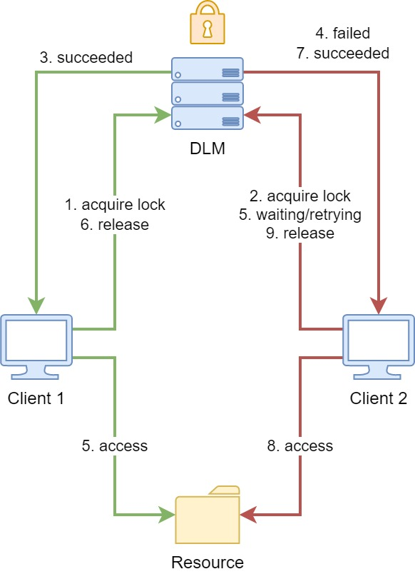
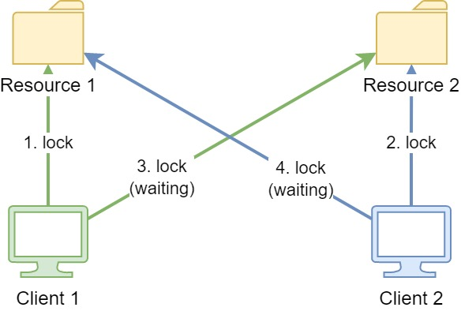
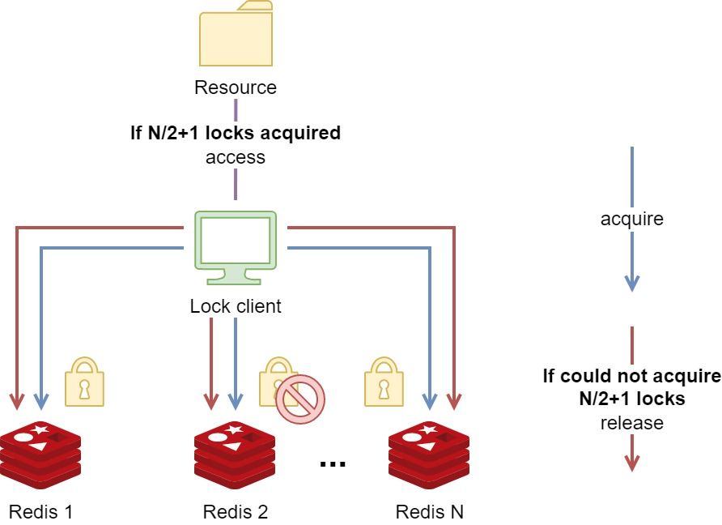

# 분산락

Redis를 사용한 분산 락(Distributed Lock)은 여러 서버나 프로세스가 공유된 자원에 동시에 접근하는 것을 제어하기 위한 동기화 메커니즘이다.

분산 환경(예: 여러 대의 웹 서버가 하나의 데이터베이스에 접근)에서는 일반적인 프로그래밍 언어의 락(lock)으로는 동시성을 제어할 수 없다.  이때, 모든 서버가 공통으로 접근할 수 있는 Redis와 같은 외부 시스템을 사용해 '잠금' 상태를 공유한다. (즉, 재고 감소, 쿠폰 발급, 포인트 지급 등 여러 요청이 동시에 들어오는 경우를 분산락 메커니즘으로 처리함)


## Redis 분산 락의 핵심 원리

https://careers.saigontechnology.com/blog-detail/implement-distributed-lock-for-a-microservices-software-system

Redis 분산 락의 기본 아이디어는 간단함.

1. **락 획득 (Acquire):** 공유 자원에 접근하려는 프로세스가 Redis에 정해진 '키(key)'를 생성하려고 시도함.
2. **키 존재 확인:**
    - **성공 (키 생성):** 키가 성공적으로 생성되면 '락을 획득'한 것으로 간주하고, 해당 프로세스가 임계 영역(Critical Section)의 작업을 수행함.
    - **실패 (키 이미 존재):** 키가 이미 존재한다면 다른 프로세스가 락을 점유 중인 것입니다. 락을 획득할 때까지 대기하거나(Spinlock) 포기함.
3. **락 해제 (Release):** 작업이 완료되면 Redis에서 해당 키를 삭제하여 다른 프로세스가 락을 획득할 수 있도록 함.




분산 잠금 관리자 (DML) : 분산 시스템에서 여러 클라이언트가 액세스할 수 있는 잠금을 관리하는 소프트웨어 구성 요소 (논리적 개념이며, 여기서 Redis가 이 역할을 함)


## **레드락 알고리즘 (The Redlock Algorithm)**

https://redis.io/docs/latest/develop/clients/patterns/distributed-locks/#the-redlock-algorithm

: Redis의 분산락 알고리즘.

### **최소한 충족**해야 할 세 가지 속성

1. **Safety property**: 상호 배제성(Mutual exclusion)
    
    : 오직 하나의 클라이언트(서버 인스턴스)만이 특정 공유 자원에 대한 락을 획득할 수 있어야 함
    
2. **Liveness property A:** 데드락 방지(Deadlock free)
    
    : 락을 획득한 클라이언트가 충돌 등의 문제로 인해 락을 해제하지 못하더라도 다른 클라이언트가 락을 획득할 수 있어야 함
    
3. **Liveness property B**: 결함 허용(Fault tolerance)
    
    : 락 관리 시스템(여기서는 Redis)에 **일부 노드의 장애**가 발생하더라도, 시스템의 과반수(Majority)가 정상 작동하는 한 클라이언트들은 여전히 락을 획득하고 해제할 수 있어야 함
    



<aside>
💡

⇒ 이러한 세 가지 속성을 모두 충족시키기 위하여 레디스에서 ‘레드락 알고리즘’을 제시한다.

(특히, 

**데드락 방지**: 옵션과 짧은 타임아웃을 통해 노드 장애 시에도 영구적인 락을 방지함.

**결함 허용**: *N* 개 중 과반수 *(N/2 + 1)* 만 성공하면 락을 인정함으로써, **일부 노드에 장애**가 발생하더라도 전체 락 시스템이 멈추지 않고 계속 작동할 수 있도록 함. 

을 위하여. )

</aside>

### 전제 조건

- N개의 **독립적인** Redis 마스터 노드
- **단일 인스턴스** 사용 구현
    1. 잠금(Lock) 획득: 
    
     `SET resource_name my_random_value NX PX 30000`
        - SET resource_name : 키 값 설정
        - my_random_value : 락을 획득한 클라이언트의 고유 식별자
        - NX : 이 키가 아직 Redis에 존재하지 않을 때만 값 설정함
            
            (키가 이미 있으면 락 획득 실패 → 상호배제 보장)
            
        - PX 30000: 키의 만료시간 30,000밀리초 (30초) 설정함
            
            (락을 영원히 해제하지 못하는 데드락 방지)
            
    2. 잠금(Lock) 해제: 
    
    ```lua
    if redis.call("get",KEYS[1]) == ARGV[1] then
        return redis.call("del",KEYS[1])
    else
        return 0
    end
    ```
    
- redis.call("get", KEYS[1]) == ARGV[1]: 
현재 락 키(`KEYS[1]`, 즉 `resource_name`)에 저장된 값이 **이 클라이언트가 설정했던 고유 값**(`ARGV[1]`, 즉 `my_random_value`)과 일치하는지 확인함.
- redis.call("del", KEYS[1]):
값이 일치하면 (내가 설정한 락이 맞으면) 키를 **삭제함**.
- else return 0:
    
    값이 일치하지 않으면 (다른 클라이언트가 락을 재획득했거나 락이 만료된 경우) 아무것도 하지 않고 0을 반환함. 
    
    (다른 클라이언트의 락을 실수로 삭제하는 것 방지)
    

### **락 획득 & 해제 과정**

**1. 시각 기록**: 락 획득을 시작한 현재 시각 *T_{start}* 을 밀리초 단위로 기록함.

**2. 병렬 요청**: *N*개의 모든 Redis 마스터에 **동일한 키, 동일한 랜덤 값, 동일한 TTL**로 락 획득(`SET ... NX PX TTL`)을 **병렬**로 시도함. 이때 각 인스턴스와의 통신 타임아웃은 **TTL보다 훨씬 짧게** 설정함.

**3. 성공 조건 확인**: 다음 두 조건을 모두 충족해야 락 획득이 **성공**으로 간주됨.

- **과반수 획득**: *N/2 + 1* (즉, 3개 이상)의 인스턴스에서 락을 획득해야 함.
- **시간 유효성**: 락 획득에 소요된 총 경과 시간 *T_{elapsed}* = *T_{end}* - *T_{start}* 이 최초 설정한 **TTL보다 짧아야** 함.

**4. 유효 시간 재계산**: 락 획득에 성공하면, 실제 유효 시간은 *TTL - T_{elapsed} - Clock_Drift* 로 재계산됨.

**5. 실패 시 해제**: 락 획득에 실패하면 (과반수 미달 또는 유효 시간 초과), **부분적으로 락이 걸린 모든 인스턴스**에 락 해제(`DEL`) 명령을 즉시 보냄.

- **안전 속성 (Safety Arguments)**
Redlock의 안전성(상호 배제)은 다음 원리로 보장됨:
• **과반수 원칙**: 락이 과반수 *(N/2 + 1)* 의 노드에 설정되어 있는 동안에는, 다른 어떤 클라이언트도 **동시에** 과반수 락을 획득할 수 없다. (이미 *(N/2 + 1)* 개의 키가 존재하기 때문)
• **시간 제한**: 클라이언트가 락을 획득하는 데 너무 오랜 시간이 걸려 *TTL*을 초과하면, 그 락은 즉시 **무효**로 간주되어 해제되므로, 동시에 락이 획득되는 상황을 방지한다.
• **유효성 보증**: 락의 최소 유효 시간 *MIN_VALIDITY* 은 *[TTL - (T_{2}-T_{1}) - CLOCK_DRIFT]* 로 보장된다.
- **활성 속성 (Liveness Arguments)**
시스템의 중단 없이 계속 작동하는 능력은 다음과 같이 보장됨:
• **자동 해제**: 모든 키에 **TTL**이 설정되어 있으므로, 락을 해제하지 못한 클라이언트가 있더라도 결국 시간이 지나면 락이 자동 해제된다. (**데드락 방지**)
• **협력적 해제**: 락 획득에 실패한 클라이언트가 **ASAP(가능한 한 빨리)** 부분적으로 걸린 락을 해제하도록 요구하여, 다른 클라이언트가 락을 기다리는 시간을 줄인다.
• **재시도 지연**: 락 획득에 실패한 클라이언트는 **랜덤한 지연 시간**을 두고 재시도하여, 여러 클라이언트가 동시에 락을 시도하며 충돌하는 상황(스플릿 브레인)을 확률적으로 낮춘다.




